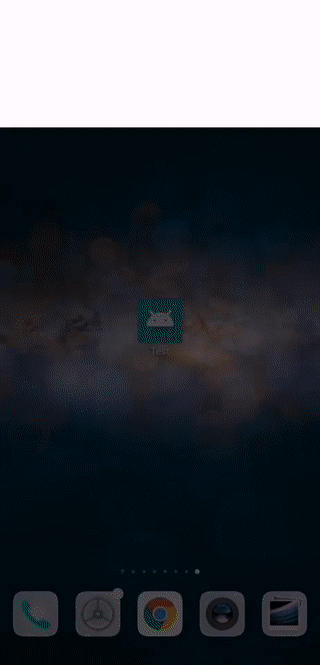

# Test 
This application have 3 screens
1. Main screen
2. Sequence screen
3. Restaurant screen

# How to run application
- `$ git clone git@github.com:jedsada-jed/test.git`
- `$ cd test`
- `$ npm install`
- `$ npm start`
- `$ npm run android` or `$ npm run ios`

# Demo

# Thank you for giving me the chance
If you have any questions or suggestions please contact me. 
